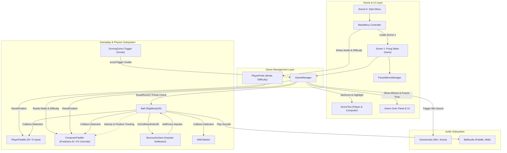
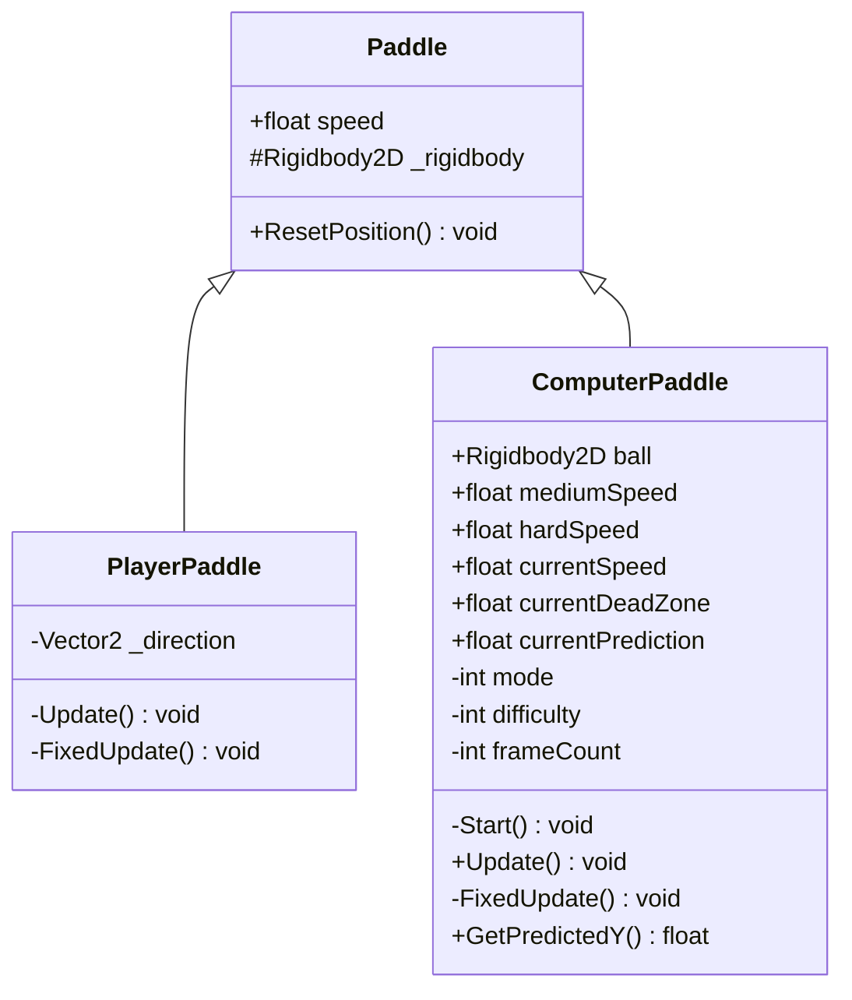
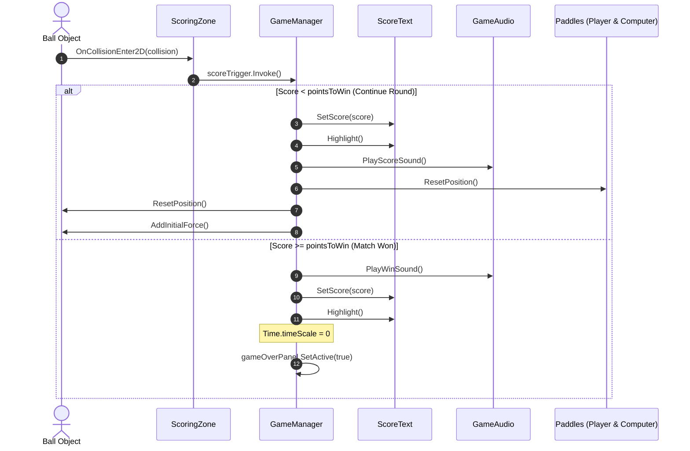

# PongoTron - System Architecture Documentation

**Document Version:** 1.0  
**Target Engine:** Unity 2021.3.45f2 (LTS)  
**Render Pipeline:** Universal Render Pipeline (URP) 2D  
**Repository Branch:** `architeture-refactor`  
**Location:** `Assets/ADocs/Architecture.md`

---

## 1. Executive Summary

**PongoTron** is a modern 2D physics-based arcade recreation of classic Pong built using Unity. The game features single-player gameplay against an adjustable AI opponent (Easy, Medium, Hard), a local two-player mode, dynamic physics with progressive ball acceleration, an animated score presentation system, and decoupled sound effects.

The architecture is structured primarily around Unity's **Component-Based Architecture** (MonoBehaviour composition), with classic object-oriented inheritance used for paddle controllers, decoupled audio triggers, and player-preference persistence bridging scenes.

---

## 2. High-Level Architecture Overview



---

## 3. Subsystem Breakdown

### 3.1 Scene & Lifecycle Management
The game spans two scenes:
1. **`Assets/Scenes/Start Menu.unity` (Build Index 0):**
   - Controlled by `MainMenu.cs`.
   - Sets difficulty (`PlayerPrefs.SetInt("Difficulty", 0 | 1 | 2)`).
   - Launches 1-Player vs AI (`Mode = 0`) or 2-Player Local PvP (`Mode = 1`).
   - Loads the gameplay scene using `SceneManager.LoadScene(buildIndex + 1)`.

2. **`Assets/Scenes/Pong.unity` (Build Index 1):**
   - Contains the game arena, paddles, ball, boundaries, camera, canvas UI, and managers.

### 3.2 Core Orchestration: `GameManager`
- **Location:** `Assets/Scripts/Managers/GameManager.cs`
- **Pattern:** MonoBehaviour pseudo-singleton (destroys duplicates in `Start()`).
- **State Tracked:**
  - `_playerScore`: Current score for Player 1.
  - `_computerScore`: Current score for Player 2 / AI.
  - `pointsToWin`: Winning threshold (default: 5).
- **Responsibilities:**
  - Coordinates round resets (`ResetRound()`) resetting paddle positions and respawning the ball.
  - Receives score events from `ScoringZone`.
  - Determines match victory, pausing simulation time (`Time.timeScale = 0`), displaying `gameOverPanel`, and calling `GameAudio.PlayWinSound()`.
  - Provides navigation hooks: `PlayAgain()` (reloads current scene) and `MainMenu()` (clears mode and reloads scene 0).

### 3.3 Physics & Game Objects

#### **Ball Subsystem (`Ball.cs`)**
- Uses a dynamic `Rigidbody2D`.
- **Spawning:** `ResetPosition()` randomizes vertical spawn within `[-maxStartY, maxStartY]`.
- **Trajectory Injection:** `AddInitialForce()` sets initial velocity with randomized horizontal (+1 or -1) and vertical angles (`0.5` to `1.0`).
- **Progressive Speed Escalation:** `IncreaseSpeed()` multiplies velocity by `speedIncreaseMultiplier` (1.1x) up to `maxSpeed` (20.0f) upon each paddle strike.
- **Collision Feedback:** Detects `Paddle` and `Wall` components on collision to trigger audio clips via `BallAudio`.

#### **Paddle Subsystem (`Paddle.cs`, `PlayerPaddle.cs`, `ComputerPaddle.cs`)**
The paddle subsystem utilizes an inheritance hierarchy:



- **`Paddle` (Base):** Holds the shared `_rigidbody` reference, base speed, and standard `ResetPosition()` (re-centers vertically to `y = 0` with zero velocity).
- **`PlayerPaddle`:** Polls standard keyboard inputs (`W` / `S`) during `Update()` and applies linear force (`_rigidbody.AddForce`) in `FixedUpdate()`.
- **`ComputerPaddle` (Dual Responsibility Component):**
  - **Player 2 Override:** If `PlayerPrefs.GetInt("Mode") == 1`, bypasses AI routines and handles keyboard input (Arrow Keys or `I`/`K`) with velocity lerping.
  - **AI Tracking & Prediction:** If `Mode == 0`, runs a predictive tracking system:
    - **Difficulty Scaling:** Configures speed, deadzone tolerance, and prediction coefficients for Easy, Medium, and Hard.
    - **Reaction Throttling:** Skips computation frames based on difficulty (`frameCount % (8 - difficulty * 2) == 0`).
    - **Prediction Algorithm:** `GetPredictedY()` calculates ball intercept:
      $$\text{predictedY} = \text{ball.position.y} + \text{ball.velocity.y} \times \left(\frac{|\text{paddle.x} - \text{ball.x}|}{|\text{ball.velocity.x}|}\right) \times \text{currentPrediction}$$
    - **Deadzone Smoothing:** Prevents paddle jitter when vertical delta is within `currentDeadZone`.

#### **Bouncy Surface & Walls (`BouncySurface.cs`, `Wall.cs`)**
- **`BouncySurface`:** Intercepts `OnCollisionEnter2D`, calculates the contact normal (`collision.GetContact(0).normal`), and adds an opposing impulse force (`-normal * bounceStrength`).
- **`Wall`:** Lightweight identifier component attached to boundary objects.

#### **Scoring Zone (`ScoringZone.cs`)**
- Attached to left and right boundary triggers.
- Detects ball entrance and executes `scoreTrigger.Invoke(BaseEventData)` through Unity's `UnityEngine.EventSystems.EventTrigger`.
- Configured in inspector to trigger `GameManager.PlayerScore()` and `GameManager.ComputerScore()`.

### 3.4 Presentation, Animation, and Audio

#### **Animated UI (`ScoreText.cs`)**
- Combines `TextMeshProUGUI` with a Unity `Animator` (`ScoreUIController.controller`).
- `SetScore(int)` updates text content.
- `Highlight()` invokes the `highlight` animator trigger (`ScoreUIIdleHighLight.anim`) to play an animated pop effect when a point is scored.

#### **Audio Separation (`BallAudio.cs`, `GameAudio.cs`)**
- **`BallAudio`:** Manages spatial/object interaction audio (`paddleSound`, `wallSound`) triggered directly by `Ball` collision events.
- **`GameAudio`:** Manages game state audio (`winSound`, `scoreSound`) triggered exclusively by `GameManager`.

---

## 4. Sequence & Control Flow

### 4.1 Scoring & Round Reset Flow



---

## 5. Architectural Evaluation

### 5.1 Key Strengths
1. **Clear Modular Split for Audio:** Separating `BallAudio` and `GameAudio` prevents god-audio managers and keeps audio triggers close to their contexts.
2. **Predictive AI Formulation:** The AI avoids simplistic direct tracking by using ball trajectory interception, deadzones, and randomized error ranges scaled by difficulty.
3. **Responsive UI Feedback:** Score updates are coupled with sprite/text animator pulses, providing punchy arcade-style feedback.
4. **Clean Asset Directory Layout:** Scripts are organized by concern (`Audio`, `Managers`, `PaddleScript`).

### 5.2 Identified Architectural Debt & Improvement Opportunities
1. **Single Responsibility Violation in `ComputerPaddle`:**
   - *Problem:* `ComputerPaddle` manages AI logic, difficulty presets, and local Player 2 keyboard input overrides.
   - *Recommendation:* Split into an abstract `PaddleInputHandler` or separate `AIPaddleController` and `HumanPaddleController` components.
2. **EventSystem Dependency for Physics Scoring:**
   - *Problem:* `ScoringZone` instantiates `BaseEventData(EventSystem.current)` and uses `EventTrigger.TriggerEvent`.
   - *Recommendation:* Replace with a standard C# event (`public static event Action<PlayerIndex> OnScore;`) or a standard `UnityEvent`, eliminating UI EventSystem overhead in physics triggers.
3. **Singleton Lifecycle in `GameManager`:**
   - *Problem:* `GameManager` destroys duplicates in `Start()`, but does not implement `DontDestroyOnLoad` or a static `Instance` accessor, leading to inspector-dragged references and scene reload reliance.
4. **Hardcoded Strings & PlayerPrefs Dependency:**
   - *Problem:* Magic strings (`"Mode"`, `"Difficulty"`, `"highlight"`) are scattered across scripts.
   - *Recommendation:* Centralize keys in a `GameConstants` or `GameSettings` ScriptableObject.
5. **TimeScale Coupling for Pause & Game Over:**
   - *Problem:* Both `PauseMenuManager` and `GameManager` manipulate `Time.timeScale` directly. A race condition can occur if pausing during game over or unpausing without verifying game state.

---

## 6. Recommended Next-Phase Refactor Plan

```
Assets/Scripts/
├── Audio/
│   ├── BallAudio.cs
│   └── GameAudio.cs
├── Core/
│   ├── GameConstants.cs          <-- Centralize PlayerPrefs keys & settings
│   ├── GameEvents.cs             <-- C# Action-based decoupled event bus
│   └── GameState.cs              <-- State enum (Menu, Playing, Paused, GameOver)
├── Input/
│   ├── IPaddleInput.cs           <-- Input abstraction
│   ├── HumanPaddleInput.cs       <-- Supports P1 (W/S) and P2 (Arrows/IK)
│   └── AIPaddleInput.cs          <-- Difficulty-driven predictive trajectory
├── Managers/
│   ├── GameManager.cs
│   └── PauseMenuManager.cs
├── Paddle/
│   └── Paddle.cs                 <-- Pure motor component receiving direction
└── Physics/
    ├── Ball.cs
    ├── BouncySurface.cs
    ├── ScoringZone.cs
    └── Wall.cs
```
