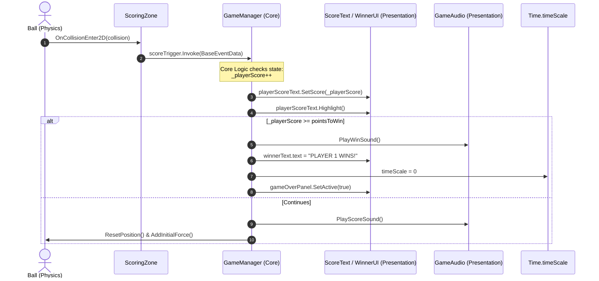
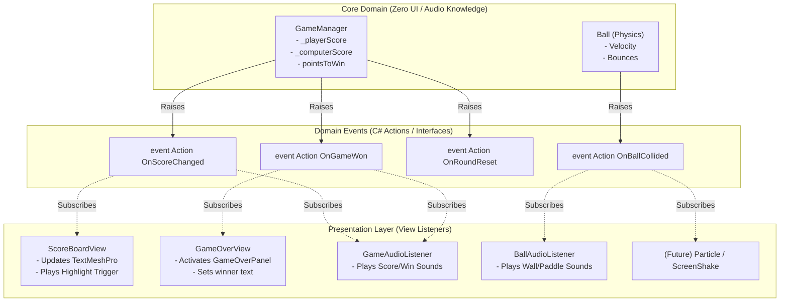

# PongTron Architecture & Dependency Web

> **Document Scope**: Analysis of component dependencies, architecture topology, and the relationship between core gameplay logic and presentation layers in the PongTron codebase.

---

## 1. Executive Summary

### Is Core Logic Connected to Presentation?

> [!CAUTION]
> **Direct Answer: YES — Strongly and Directly Coupled.**
> 
> The core gameplay logic is **tightly coupled** to the presentation layer (UI, TextMeshPro, Animators, and AudioSource components). Rather than following an event-driven or decoupled pattern (such as Observer, MVC, or MVP), core domain classes directly hold references to presentation components and imperatively trigger UI state changes, animations, and sound effects.

### Key Findings at a Glance
1. **`GameManager` (Core Rules & State)**:
   - Holds direct inspector references to `ScoreText` (UI), `TextMeshProUGUI` (UI), `gameOverPanel` (`GameObject` UI canvas), and `GameAudio` (Audio).
   - Imperatively mutates UI text (`winnerText.text = ...`), pushes score values (`playerScoreText.SetScore(...)`), activates UI panels (`gameOverPanel.SetActive(...)`), triggers UI animations (`playerScoreText.Highlight(...)`), and triggers sounds (`gameAudio.PlayWinSound(...)`).
2. **`Ball` (Core Physics)**:
   - Holds a direct reference to `BallAudio`.
   - Directly calls `ballAudio.PlayPaddleSound()` and `ballAudio.PlayWallSound()` inside physics collision handlers (`OnCollisionEnter2D`).
3. **`ScoringZone` (Physics Collision)**:
   - Employs `UnityEngine.EventSystems.EventTrigger.TriggerEvent` with a synthetic UI event (`BaseEventData(EventSystem.current)`) for physics boundary detections.
4. **`ComputerPaddle` (AI Controller)**:
   - Combines AI motion tracking with Player 2 keyboard input overrides and reads persistent storage (`PlayerPrefs`) directly.

---

## 2. Full System Dependency Web

The following Mermaid diagram visualizes the dependency relationships across the entire codebase.

```mermaid
flowchart TD
    %% Styling Classes
    classDef coreLogic fill:#1e3a8a,stroke:#3b82f6,stroke-width:2px,color:#ffffff;
    classDef presentation fill:#b45309,stroke:#f59e0b,stroke-width:2px,color:#ffffff;
    classDef audio fill:#701a75,stroke:#d946ef,stroke-width:2px,color:#ffffff;
    classDef infra fill:#1f2937,stroke:#6b7280,stroke-width:2px,color:#ffffff;

    %% Subgraph: Core Logic
    subgraph CoreLogic["Core Gameplay Logic"]
        GM["GameManager\n(Rules, State, Round Flow)"]:::coreLogic
        Ball["Ball\n(Physics, Velocity, Speed Ramping)"]:::coreLogic
        PaddleBase["Paddle (Base)\n(Velocity & Reset)"]:::coreLogic
        PlayerPaddle["PlayerPaddle\n(Player 1 WASD Input)"]:::coreLogic
        CompPaddle["ComputerPaddle\n(AI Tracking / P2 Input)"]:::coreLogic
        ScoringZone["ScoringZone\n(Goal Line Trigger)"]:::coreLogic
        BouncySurface["BouncySurface\n(Elastic Collisions)"]:::coreLogic
        Wall["Wall\n(Marker Component)"]:::coreLogic
    end

    %% Subgraph: Presentation / UI Layer
    subgraph PresentationLayer["Presentation Layer (UI & Visuals)"]
        ScoreTextP1["ScoreText (P1)\n(UI Text & Animator)"]:::presentation
        ScoreTextP2["ScoreText (P2)\n(UI Text & Animator)"]:::presentation
        GameOverPanel["GameOverPanel\n(Canvas UI GameObject)"]:::presentation
        WinnerText["WinnerText\n(TextMeshProUGUI)"]:::presentation
        PauseMenu["PauseMenuManager\n(Pause UI & Time Scale)"]:::presentation
        MainMenu["MainMenu\n(Title & Difficulty UI)"]:::presentation
    end

    %% Subgraph: Presentation / Audio Layer
    subgraph AudioLayer["Presentation Layer (Audio)"]
        GameAudio["GameAudio\n(Score & Win AudioClips)"]:::audio
        BallAudio["BallAudio\n(Paddle & Wall AudioClips)"]:::audio
    end

    %% Subgraph: Infrastructure & Engine
    subgraph Infrastructure["Engine & Persistent State"]
        TimeScale["Time.timeScale"]:::infra
        PlayerPrefsStorage[("PlayerPrefs\n('Mode', 'Difficulty')")]:::infra
        SceneMgr["SceneManager"]:::infra
    end

    %% Dependencies: Core to Presentation (TIGHT COUPLING)
    GM ==>|"Direct Ref & Method Calls\n(SetScore, Highlight)"| ScoreTextP1
    GM ==>|"Direct Ref & Method Calls\n(SetScore, Highlight)"| ScoreTextP2
    GM ==>|"Direct String Assignment\n(text = 'PLAYER X WINS!')"| WinnerText
    GM ==>|"Direct State Change\n(SetActive true/false)"| GameOverPanel
    GM ==>|"Direct Ref & Method Calls\n(PlayScoreSound, PlayWinSound)"| GameAudio
    GM -->|"Freezes Game\n(timeScale = 0)"| TimeScale

    %% Dependencies: Physics to Audio (TIGHT COUPLING)
    Ball ==>|"Direct Ref & Method Calls\n(PlayPaddleSound, PlayWallSound)"| BallAudio

    %% Dependencies: Core to Core
    GM -->|"Round Control\n(ResetPosition, AddInitialForce)"| Ball
    GM -->|"Round Reset\n(ResetPosition)"| PlayerPaddle
    GM -->|"Round Reset\n(ResetPosition)"| CompPaddle
    PlayerPaddle --|>|"Inherits"| PaddleBase
    CompPaddle --|>|"Inherits"| PaddleBase
    CompPaddle -->|"Reads Position & Velocity"| Ball

    %% Physics Collisions
    Ball -.->|"OnCollisionEnter2D detects"| PaddleBase
    Ball -.->|"OnCollisionEnter2D detects"| Wall
    BouncySurface -.->|"OnCollisionEnter2D AddForce"| Ball
    ScoringZone -.->|"OnCollisionEnter2D detects"| Ball

    %% EventTriggers
    ScoringZone ==>|"EventTrigger.scoreTrigger.Invoke()"| GM

    %% Menu / Scene Dependencies
    MainMenu -->|"Sets Mode & Difficulty"| PlayerPrefsStorage
    MainMenu -->|"Loads Gameplay Scene"| SceneMgr
    CompPaddle -->|"Reads Mode & Difficulty"| PlayerPrefsStorage
    PauseMenu -->|"Sets timeScale 0/1"| TimeScale
    PauseMenu -->|"Reloads / Loads Scene"| SceneMgr
    GM -->|"PlayAgain() / MainMenu()"| SceneMgr
```

---

## 3. Detailed Component Breakdown

| Component | Layer | Primary Responsibility | Outgoing Dependencies | Incoming Dependencies | Presentation Coupled? |
| :--- | :--- | :--- | :--- | :--- | :--- |
| **`GameManager`** | Core Logic | Game lifecycle, scoring rules, win conditions, round reset | `Ball`, `Paddle`, `ScoreText`, `TMPro.TextMeshProUGUI`, `GameObject` (UI panel), `GameAudio`, `SceneManager`, `Time` | `ScoringZone` (via `scoreTrigger`) | **YES (Heavy)** |
| **`Ball`** | Core Logic (Physics) | Ball trajectory, speed multiplier, collision deflection | `BallAudio`, `Paddle`, `Wall`, `Rigidbody2D` | `GameManager`, `ComputerPaddle`, `BouncySurface`, `ScoringZone` | **YES (Direct)** |
| **`Paddle`** | Core Logic | Base paddle movement and position resetting | `Rigidbody2D` | `GameManager`, `Ball` | **No** |
| **`PlayerPaddle`** | Core Logic (Input) | Player 1 keyboard input (W/S) and physical force | `Paddle`, `Input`, `Rigidbody2D` | `GameManager` | **No** |
| **`ComputerPaddle`** | Core Logic / AI | AI tracking calculations, dead zones, prediction, or P2 manual input | `Paddle`, `Rigidbody2D` (Ball), `PlayerPrefs`, `Input` | `GameManager` | **Mixed (Reads UI Config)** |
| **`ScoringZone`** | Core Logic / Trigger | Goal detection when ball crosses boundary | `Ball`, `EventTrigger` (`EventSystem.current`), `GameManager` | Physics engine | **Indirect (UI EventTrigger)** |
| **`BouncySurface`** | Core Logic (Physics) | Impulse force reflection | `Ball`, `Collision2D` | Physics engine | **No** |
| **`Wall`** | Core Logic (Marker) | Collider identifier tag for bounces | None | `Ball` | **No** |
| **`ScoreText`** | Presentation (UI) | Visual score counter and highlight animation | `TextMeshProUGUI`, `Animator` | `GameManager` | **Yes (Pure View)** |
| **`GameAudio`** | Presentation (Audio) | Plays win and score sound effects | `AudioSource`, `AudioClip` | `GameManager` | **Yes (Pure Audio View)** |
| **`BallAudio`** | Presentation (Audio) | Plays wall hit and paddle hit sound effects | `AudioSource`, `AudioClip` | `Ball` | **Yes (Pure Audio View)** |
| **`PauseMenuManager`**| Presentation / Control | Pauses game, toggles UI overlay | `GameObject` (panel), `Time`, `SceneManager`, `Input` | None (Scene Root) | **Yes** |
| **`MainMenu`** | Presentation / Navigation | Sets game settings, loads gameplay scene | `PlayerPrefs`, `SceneManager` | None (Scene Root) | **Yes** |

---

## 4. Deep-Dive: Core Logic to Presentation Coupling Points

### 4.1. `GameManager.cs` ⟷ UI & Audio

`GameManager` functions as both the domain rules engine and the view presenter:

```csharp
// Excerpt from Assets/Scripts/Managers/GameManager.cs
public class GameManager : MonoBehaviour
{
    // CORE LOGIC REFERENCES
    public Ball ball;
    public Paddle playerPaddle;
    public Paddle computerPaddle;
    public int pointsToWin = 5;
    private int _playerScore;
    private int _computerScore;

    // PRESENTATION REFERENCES (Direct Coupling)
    public ScoreText playerScoreText;            // UI Component
    public ScoreText computerScoreText;          // UI Component
    public GameObject gameOverPanel;             // UI Canvas Hierarchy
    public TMPro.TextMeshProUGUI winnerText;     // Text Rendering
    [SerializeField] private GameAudio gameAudio;// Audio System

    public void PlayerScore()
    {
        _playerScore++;                          // [Core Logic] State mutation
        
        playerScoreText.SetScore(_playerScore);  // [Presentation] Direct UI mutation
        playerScoreText.Highlight();             // [Presentation] Direct Animation trigger

        if (_playerScore >= pointsToWin)         // [Core Logic] Win condition
        {
            gameAudio.PlayWinSound();            // [Presentation] Direct Audio trigger
            winnerText.text = "PLAYER 1 WINS!";  // [Presentation] Direct String mutation
            Time.timeScale = 0;                  // [Engine] Pausing simulation
            gameOverPanel.SetActive(true);       // [Presentation] Canvas toggling
        }
        else
        {
            gameAudio.PlayScoreSound();          // [Presentation] Direct Audio trigger
            ResetRound();                        // [Core Logic] Game loop reset
        }
    }
}
```

#### Why This is Problematic:
1. **Single Responsibility Violation**: `GameManager` is responsible for calculating scores, determining the winner, rendering text, firing animations, playing audio, and pausing the game clock.
2. **Untestable Gameplay Logic**: You cannot write a unit test for game rules without instantiating or mocking `TextMeshProUGUI`, `Animator`, `AudioSource`, and the Unity UI hierarchy.
3. **NullReference Fragility**: If an artist or designer renames a UI text object or forgets to link `gameAudio` in the Inspector, the entire scoring pipeline halts with a `NullReferenceException`.

---

### 4.2. `Ball.cs` ⟷ `BallAudio.cs` (Physics ⟷ Audio)

`Ball` handles 2D physics movement, but directly commands sound output:

```csharp
// Excerpt from Assets/Scripts/Ball.cs
public class Ball : MonoBehaviour
{
    public BallAudio ballAudio; // Direct coupling to audio view

    private void OnCollisionEnter2D(Collision2D collision)
    {
        Paddle paddle = collision.gameObject.GetComponent<Paddle>();
        if (paddle != null)
        {
            ballAudio.PlayPaddleSound(); // Direct presentation call
            IncreaseSpeed();
        }

        Wall wall = collision.gameObject.GetComponent<Wall>();
        if (wall != null)
        {
            ballAudio.PlayWallSound();   // Direct presentation call
        }
    }
}
```

#### Why This is Problematic:
- The ball's physics simulation cannot run in a headless environment, simulated dedicated server, or batch-testing runner without an audio subsystem.
- Adding visual effects (e.g. particle spark, screen shake) would tempt developers to inject `ParticleSystem` or `CinemachineImpulseSource` directly into `Ball.cs`, compounding the coupling.

---

### 4.3. `ScoringZone.cs` ⟷ UI EventSystem

`ScoringZone` uses `UnityEngine.EventSystems.EventTrigger.TriggerEvent`:

```csharp
// Excerpt from Assets/Scripts/ScoringZone.cs
public EventTrigger.TriggerEvent scoreTrigger;

private void OnCollisionEnter2D(Collision2D collision)
{
    Ball ball = collision.gameObject.GetComponent<Ball>();
    if (ball != null)
    {
        // Synthesizes a UI EventSystem argument for a 2D physics collision!
        BaseEventData eventData = new BaseEventData(EventSystem.current);
        this.scoreTrigger.Invoke(eventData);
    }
}
```

#### Why This is Problematic:
- `EventTrigger.TriggerEvent` is specifically designed for UI Pointer events (clicks, hovers, drags) inside Unity's UI `EventSystem`.
- Coupling physics trigger detection to `EventSystem.current` creates hidden inspector references and causes silent failures if an `EventSystem` component is missing from the scene.

---

### 4.4. `ComputerPaddle.cs` ⟷ Input & Persistent Storage

```csharp
// Excerpt from Assets/Scripts/PaddleScript/ComputerPaddle.cs
private void Start()
{
    mode = PlayerPrefs.GetInt("Mode", 0);            // Direct dependency on PlayerPrefs
    difficulty = PlayerPrefs.GetInt("Difficulty", 0);// Direct dependency on PlayerPrefs
    // ...
}

public void Update()
{
    if (PlayerPrefs.GetInt("Mode", 0) == 1)          // 2-Player mode bypasses AI
    {
        // Polling arrow keys / I / K directly in ComputerPaddle script
    }
}
```

#### Why This is Problematic:
- An AI paddle class contains human player input logic for Player 2.
- The control mode is queried directly from `PlayerPrefs` in every `Update()` cycle rather than injected cleanly through an initialization or dependency injection system.

---

## 5. Event Flow Sequences

### Current Tightly-Coupled Flow (Point Scored)



---

## 6. Recommended Architecture: Decoupling Core from Presentation

To decouple the core domain from presentation, the project should adopt an **Observer / Event-Driven Architecture** (using pure C# `event Action` or ScriptableObject Events).

### Proposed Decoupled Topology



---

### 6.1. Refactoring Code Example: Pure Core `GameManager`

```csharp
using System;
using UnityEngine;

public class GameManagerDecoupled : MonoBehaviour
{
    // Pure gameplay events - NO UI OR AUDIO DEPENDENCIES
    public static event Action<int, int> OnScoreUpdated; // (playerIndex, newScore)
    public static event Action<int> OnGameWon;           // (winningPlayerIndex)
    public static event Action OnRoundReset;

    [SerializeField] private int pointsToWin = 5;
    [SerializeField] private Ball ball;
    [SerializeField] private Paddle playerPaddle;
    [SerializeField] private Paddle computerPaddle;

    private int _playerScore;
    private int _computerScore;

    public void PlayerScore()
    {
        _playerScore++;
        OnScoreUpdated?.Invoke(1, _playerScore);

        if (_playerScore >= pointsToWin)
        {
            OnGameWon?.Invoke(1);
        }
        else
        {
            ResetRound();
        }
    }

    public void ComputerScore()
    {
        _computerScore++;
        OnScoreUpdated?.Invoke(2, _computerScore);

        if (_computerScore >= pointsToWin)
        {
            OnGameWon?.Invoke(2);
        }
        else
        {
            ResetRound();
        }
    }

    private void ResetRound()
    {
        playerPaddle.ResetPosition();
        computerPaddle.ResetPosition();
        ball.ResetPosition();
        ball.AddInitialForce();
        OnRoundReset?.Invoke();
    }
}
```

### 6.2. Decoupled View Listener: `ScoreView.cs`

```csharp
using UnityEngine;
using TMPro;

public class ScoreView : MonoBehaviour
{
    [SerializeField] private int playerIndex = 1;
    [SerializeField] private TextMeshProUGUI text;
    [SerializeField] private Animator animator;

    private void OnEnable()
    {
        GameManagerDecoupled.OnScoreUpdated += HandleScoreUpdated;
    }

    private void OnDisable()
    {
        GameManagerDecoupled.OnScoreUpdated -= HandleScoreUpdated;
    }

    private void HandleScoreUpdated(int player, int newScore)
    {
        if (player == playerIndex)
        {
            text.text = newScore.ToString();
            animator.SetTrigger("highlight");
        }
    }
}
```

### 6.3. Decoupled Audio Listener: `GameAudioListener.cs`

```csharp
using UnityEngine;

public class GameAudioListener : MonoBehaviour
{
    [SerializeField] private AudioSource audioSource;
    [SerializeField] private AudioClip scoreSound;
    [SerializeField] private AudioClip winSound;

    private void OnEnable()
    {
        GameManagerDecoupled.OnScoreUpdated += (p, s) => audioSource.PlayOneShot(scoreSound);
        GameManagerDecoupled.OnGameWon += (p) => audioSource.PlayOneShot(winSound);
    }

    private void OnDisable()
    {
        // Unsubscribe to avoid memory leaks
    }
}
```

---

## 7. Benefits of the Decoupled Architecture

1. **Independent Testing**: Core gameplay mechanics (rules, scoring, physics) can be thoroughly tested via PlayMode or EditMode unit tests without UI mockups.
2. **Extensibility**: Adding visual flair (particle bursts, screen rumble, crowd cheers) requires only adding a new subscriber component — **zero edits** to `GameManager.cs` or `Ball.cs`.
3. **Platform Flexibility**: If UI frameworks change (e.g. from Canvas UGUI to UI Toolkit), gameplay scripts remain 100% unaffected.
4. **Clean Codebase**: Respects SOLID design principles, particularly the Single Responsibility Principle and the Open/Closed Principle.
