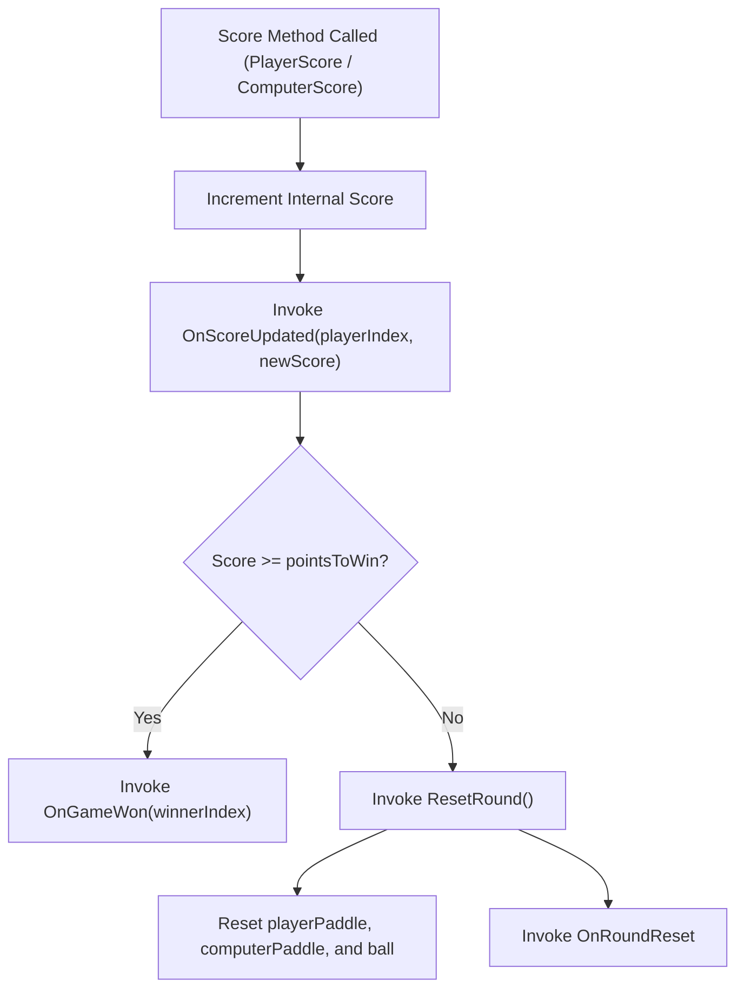

# Unity Test Framework: GamePlay Directory Testability Report (EditMode)

This report provides an in-depth analysis of the scripts located in [`Assets/Scripts/GamePlay`](file:///E:/Game%20Development/Unity/PongTron/PongTron%20Source/Assets/Scripts/GamePlay) for **PongTron**. It categorizes which files can be tested using the **Unity Test Framework (UTF)** in **EditMode**, identifies the exact methods and functions to test, explains why certain scripts or methods have limitations in EditMode, and provides complete, ready-to-use EditMode test scripts.

---

## 1. Summary of Testability by File

| Script | EditMode Testability | Primary Functions / Methods to Test | Key Reason / Considerations |
| :--- | :--- | :--- | :--- |
| [`GameManager.cs`](file:///E:/Game%20Development/Unity/PongTron/PongTron%20Source/Assets/Scripts/GamePlay/GameManager.cs) | **High (Fully Testable)** | `PlayerScore()`, `ComputerScore()`, `ResetRound()`, `PlayAgain()`, `MainMenu()` | Pure game flow logic, score tracking, win threshold detection, and static event broadcasting. |
| [`Ball.cs`](file:///E:/Game%20Development/Unity/PongTron/PongTron%20Source/Assets/Scripts/GamePlay/Ball.cs) | **High (Fully Testable)** | `ResetPosition()`, `AddInitialForce()`, `IncreaseSpeed()`, `AddForce()` | Velocity calculation, boundary clamping, speed multiplier logic, and position randomization bounds. |
| [`Paddle.cs`](file:///E:/Game%20Development/Unity/PongTron/PongTron%20Source/Assets/Scripts/GamePlay/Paddle.cs) | **High (Fully Testable)** | `ResetPosition()`, default speed verification | Resets vertical position to 0 while preserving horizontal coordinate and zeroing velocity. |
| [`ComputerPaddle.cs`](file:///E:/Game%20Development/Unity/PongTron/PongTron%20Source/Assets/Scripts/GamePlay/ComputerPaddle.cs) | **High (Algorithmic Logic)** | `GetPredictedY()`, inherited `ResetPosition()`, AI difficulty defaults | Pure mathematical trajectory extrapolation based on distance, ball velocity, and prediction scaling. |
| [`PlayerPaddle.cs`](file:///E:/Game%20Development/Unity/PongTron/PongTron%20Source/Assets/Scripts/GamePlay/PlayerPaddle.cs) | **Partial (Inherited Only)** | Inherited `ResetPosition()`, default fields | `Update()` couples directly to static `Input.GetKey()` which cannot be mocked in EditMode without an abstraction layer. |
| [`ScoringZone.cs`](file:///E:/Game%20Development/Unity/PongTron/PongTron%20Source/Assets/Scripts/GamePlay/ScoringZone.cs) | **Partial (Event Only)** | `scoreTrigger.Invoke()` | The `EventTrigger.TriggerEvent` can be tested in isolation, but `OnCollisionEnter2D` requires a 2D physics contact which cannot be generated in EditMode. |
| [`BouncySurface.cs`](file:///E:/Game%20Development/Unity/PongTron/PongTron%20Source/Assets/Scripts/GamePlay/BouncySurface.cs) | **Untestable (As written)** | Property inspection only (`bounceStrnegth`) | Relies exclusively on `OnCollisionEnter2D` and `Collision2D.GetContact(0).normal`. `Collision2D` cannot be instantiated in EditMode. |
| [`Wall.cs`](file:///E:/Game%20Development/Unity/PongTron/PongTron%20Source/Assets/Scripts/GamePlay/Wall.cs) | **Untestable (No Logic)** | None | Tag/marker component with empty `Start()` and `Update()` stubs. Contains no state or logic. |

---

## 2. Detailed Breakdown of Testable Scripts and Methods

### 2.1 [`GameManager.cs`](file:///E:/Game%20Development/Unity/PongTron/PongTron%20Source/Assets/Scripts/GamePlay/GameManager.cs)

`GameManager` manages game loop states, points, victory evaluation, and triggers round resets.



#### Functions & Methods to Test:
1. **`PlayerScore()`**:
   - **Score Increment**: Score increases by 1 each time it is called.
   - **Event Broadcast**: Triggers `GameManager.OnScoreUpdated` with `playerIndex = 1` and the incremented score.
   - **Sub-win Round Reset**: When `_playerScore < pointsToWin`, `ResetRound()` is invoked, resetting both paddles and the ball, and firing `OnRoundReset`.
   - **Victory Condition**: When `_playerScore >= pointsToWin`, triggers `GameManager.OnGameWon` with winner index `1` and halts further round resets.
2. **`ComputerScore()`**:
   - **Score Increment**: Computer score increases by 1.
   - **Event Broadcast**: Triggers `GameManager.OnScoreUpdated` with `playerIndex = 2` and updated score.
   - **Victory Condition**: Triggers `GameManager.OnGameWon` with winner index `2` when reaching `pointsToWin`.
3. **`ResetRound()`**:
   - Verifies that `playerPaddle.ResetPosition()`, `computerPaddle.ResetPosition()`, `ball.ResetPosition()`, and `ball.AddInitialForce()` are invoked.
   - Verifies that `GameManager.OnRoundReset` is fired.
4. **`PlayAgain()` & `MainMenu()`**:
   - Verifies `Time.timeScale` is restored to `1.0f`.
   - Verifies `PlayerPrefs.DeleteKey("Mode")` is invoked in `MainMenu()`.

---

### 2.2 [`Ball.cs`](file:///E:/Game%20Development/Unity/PongTron/PongTron%20Source/Assets/Scripts/GamePlay/Ball.cs)

`Ball` handles motion dynamics, speed acceleration, launch directions, and reset positions.

#### Functions & Methods to Test:
1. **`ResetPosition()`**:
   - **X Coordinate Reset**: Ball horizontal position `_rigidbody.position.x` must always be reset to exactly `0f`.
   - **Velocity Reset**: `_rigidbody.velocity` must be reset to `Vector2.zero`.
   - **Y Range Boundary**: Ball vertical position must be bounded within `[-maxStartY, maxStartY]` (`[-4f, 4f]`).
   - **Lazy Component Initialization**: Works reliably even if `Awake()` was not called because of the internal null check (`if (_rigidbody == null)`).
2. **`AddInitialForce()`**:
   - **Speed Magnitude**: Sets velocity such that `velocity.magnitude` is approximately equal to `ball.speed` (`10.0f`).
   - **Non-Zero Trajectory**: Ensures `velocity.x != 0` so the ball never moves strictly vertically.
3. **`IncreaseSpeed()`**:
   - **Stationary Guard**: When `_rigidbody.velocity == Vector2.zero`, calling `IncreaseSpeed()` returns early without altering velocity.
   - **Multiplier Calculation**: When moving, velocity magnitude is multiplied by `speedIncreaseMultiplier` (`1.1f`).
   - **Max Speed Clamp**: When speed reaches or exceeds `maxSpeed` (`20.0f`), the velocity magnitude is strictly clamped to `20.0f`.
   - **Direction Preservation**: The normalized vector direction (`velocity.normalized`) remains unchanged after the speed increase.
4. **`AddForce(Vector2 force)`**:
   - Validates that force passes directly to the underlying `Rigidbody2D`.

---

### 2.3 [`Paddle.cs`](file:///E:/Game%20Development/Unity/PongTron/PongTron%20Source/Assets/Scripts/GamePlay/Paddle.cs)

`Paddle` acts as the base class for both `PlayerPaddle` and `ComputerPaddle`.

#### Functions & Methods to Test:
1. **`ResetPosition()`**:
   - **Y Coordinate Reset**: Sets `_rigidbody.position.y` to `0.0f`.
   - **Horizontal Preservation**: Preserves `_rigidbody.position.x` unchanged (ensuring the paddle stays on its assigned side of the court).
   - **Velocity Reset**: Clears velocity to `Vector2.zero`.
   - **Null Resiliency**: Performs lazy binding if `Awake()` has not executed.
2. **Default Configurations**:
   - Asserts default `speed` is initialized to `10.0f`.

---

### 2.4 [`ComputerPaddle.cs`](file:///E:/Game%20Development/Unity/PongTron/PongTron%20Source/Assets/Scripts/GamePlay/ComputerPaddle.cs)

`ComputerPaddle` inherits from `Paddle` and calculates intercept trajectories for AI play.

#### Functions & Methods to Test:
1. **`GetPredictedY()`** *(Prime EditMode candidate: Pure algorithmic logic)*:
   - **Formula under test**:
     $$\text{distanceX} = |\text{paddle.x} - \text{ball.x}|$$
     $$\text{time} = \frac{\text{distanceX}}{|\text{ball.velocity.x}|}$$
     $$\text{predictedY} = \text{ball.position.y} + \text{ball.velocity.y} \times \text{time} \times \text{currentPrediction}$$
   - **Case 1 (Zero / Negative Prediction)**: When `currentPrediction <= 0`, immediately returns raw `ball.position.y`.
   - **Case 2 (Ball Moving Away / Stationary in X)**: When `ball.velocity.x <= 0`, immediately returns raw `ball.position.y`.
   - **Case 3 (Active Prediction with Factor 1.0)**:
     - Example: Paddle at $X = 10$, Ball at $(0, 1)$, Velocity $(5, 2)$.
     - $\text{distanceX} = 10$, $\text{time} = 2.0\text{s}$, $\text{predictedY} = 1 + (2 \times 2 \times 1.0) = 5.0\text{f}$.
   - **Case 4 (Partial Prediction with Factor 0.5)**:
     - Same setup with $\text{currentPrediction} = 0.5\text{f} \implies \text{predictedY} = 1 + (2 \times 2 \times 0.5) = 3.0\text{f}$.
   - **Case 5 (Negative Ball Velocity Y)**:
     - Ball velocity $(5, -3) \implies \text{predictedY} = 1 + (-3 \times 2 \times 1.0) = -5.0\text{f}$.
2. **Inherited `ResetPosition()`**:
   - Resets Y to 0, preserves X, stops velocity.
3. **Difficulty Constants**:
   - Validates ranges for easy, medium, and hard speeds (`mediumSpeed = 12f`, `hardSpeed = 14f`), dead zones, and prediction minimums/maximums.

---

### 2.5 Partial and Untestable Scripts: Architectural Analysis

#### [`PlayerPaddle.cs`](file:///E:/Game%20Development/Unity/PongTron/PongTron%20Source/Assets/Scripts/GamePlay/PlayerPaddle.cs)
- **Why EditMode cannot test movement**: `Update()` directly queries `Input.GetKey(KeyCode.W)` and `Input.GetKey(KeyCode.S)`. In EditMode, static `Input` calls return `false` and cannot be mocked without an abstraction interface (e.g. `IInputService`) or the new Unity Input System fixture.
- **What can be tested**: Inherited `ResetPosition()` and initial variable states.

#### [`ScoringZone.cs`](file:///E:/Game%20Development/Unity/PongTron/PongTron%20Source/Assets/Scripts/GamePlay/ScoringZone.cs)
- **Why EditMode cannot test collisions**: `OnCollisionEnter2D(Collision2D collision)` requires an active 2D physics simulation contact. `Collision2D` has internal constructors in Unity and cannot be created manually.
- **What can be tested**: Direct subscription and invocation of `scoreTrigger` (`EventTrigger.TriggerEvent`).

#### [`BouncySurface.cs`](file:///E:/Game%20Development/Unity/PongTron/PongTron%20Source/Assets/Scripts/GamePlay/BouncySurface.cs)
- **Why untestable in EditMode**: Only has `bounceStrnegth` and `OnCollisionEnter2D`. It relies on `collision.GetContact(0).normal`.
- **Refactoring suggestion for 100% EditMode testability**:
  ```csharp
  // Extract physics logic into a pure method:
  public void ApplyBounce(Ball targetBall, Vector2 contactNormal)
  {
      targetBall.AddForce(-contactNormal * this.bounceStrnegth);
  }
  ```

#### [`Wall.cs`](file:///E:/Game%20Development/Unity/PongTron/PongTron%20Source/Assets/Scripts/GamePlay/Wall.cs)
- **Why untestable**: Contains no logic, fields, or behaviors. Exists solely as an identifier component.

---

## 3. Production-Ready EditMode Test Scripts

Below are complete, self-contained EditMode test scripts designed for the Unity Test Framework (NUnit).

### Script 1: `BallTests.cs`
Tests [`Ball.cs`](file:///E:/Game%20Development/Unity/PongTron/PongTron%20Source/Assets/Scripts/GamePlay/Ball.cs) for reset boundaries, launch forces, and speed acceleration.

```csharp
using NUnit.Framework;
using UnityEngine;

public class BallTests
{
    private GameObject _ballObject;
    private Ball _ball;
    private Rigidbody2D _rigidbody;

    [SetUp]
    public void SetUp()
    {
        _ballObject = new GameObject("TestBall");
        _rigidbody = _ballObject.AddComponent<Rigidbody2D>();
        _ball = _ballObject.AddComponent<Ball>();
    }

    [TearDown]
    public void TearDown()
    {
        if (_ballObject != null)
        {
            Object.DestroyImmediate(_ballObject);
        }
    }

    [Test]
    public void ResetPosition_ResetsHorizontalPositionAndVelocity_AndRandomizesYWithinBounds()
    {
        // Arrange
        _rigidbody.position = new Vector2(10f, 15f);
        _rigidbody.velocity = new Vector2(5f, -3f);

        // Act
        _ball.ResetPosition();

        // Assert
        Assert.AreEqual(0f, _rigidbody.position.x, 0.001f, "Ball X position must reset to 0.");
        Assert.AreEqual(Vector2.zero, _rigidbody.velocity, "Ball velocity must reset to zero.");
        Assert.GreaterOrEqual(_rigidbody.position.y, -4f, "Ball Y position must be within [-4, 4].");
        Assert.LessOrEqual(_rigidbody.position.y, 4f, "Ball Y position must be within [-4, 4].");
    }

    [Test]
    public void AddInitialForce_SetsVelocityMagnitudeToSpeed()
    {
        // Arrange
        _ball.speed = 10f;
        _rigidbody.velocity = Vector2.zero;

        // Act
        _ball.AddInitialForce();

        // Assert
        Assert.AreNotEqual(Vector2.zero, _rigidbody.velocity, "Ball velocity should not be zero after AddInitialForce.");
        Assert.AreNotEqual(0f, _rigidbody.velocity.x, "Ball X velocity component must not be zero.");
        Assert.AreEqual(_ball.speed, _rigidbody.velocity.magnitude, 0.01f, "Ball velocity magnitude should equal configured speed.");
    }

    [Test]
    public void IncreaseSpeed_WhenStationary_DoesNotIncreaseSpeed()
    {
        // Arrange
        _rigidbody.velocity = Vector2.zero;

        // Act
        _ball.IncreaseSpeed();

        // Assert
        Assert.AreEqual(Vector2.zero, _rigidbody.velocity, "IncreaseSpeed on zero velocity should do nothing.");
    }

    [Test]
    public void IncreaseSpeed_WithActiveVelocity_IncreasesSpeedByMultiplier()
    {
        // Arrange: default multiplier is 1.1x
        Vector2 initialVelocity = new Vector2(10f, 0f);
        _rigidbody.velocity = initialVelocity;

        // Act
        _ball.IncreaseSpeed();

        // Assert: 10 * 1.1 = 11f
        float expectedSpeed = 11.0f;
        Assert.AreEqual(expectedSpeed, _rigidbody.velocity.magnitude, 0.01f, "Ball speed should increase by 1.1x.");
        Assert.AreEqual(new Vector2(1f, 0f), _rigidbody.velocity.normalized, "Velocity direction must remain unchanged.");
    }

    [Test]
    public void IncreaseSpeed_ClampsToMaxSpeed()
    {
        // Arrange: 19f * 1.1f = 20.9f -> clamped to maxSpeed (20f)
        _rigidbody.velocity = new Vector2(19f, 0f);

        // Act
        _ball.IncreaseSpeed();

        // Assert
        float maxSpeed = 20f;
        Assert.AreEqual(maxSpeed, _rigidbody.velocity.magnitude, 0.01f, "Ball speed must be clamped to maxSpeed (20f).");
    }
}
```

---

### Script 2: `PaddleTests.cs`
Tests [`Paddle.cs`](file:///E:/Game%20Development/Unity/PongTron/PongTron%20Source/Assets/Scripts/GamePlay/Paddle.cs) for reset functionality and default settings.

```csharp
using NUnit.Framework;
using UnityEngine;

public class PaddleTests
{
    private GameObject _paddleObject;
    private Paddle _paddle;
    private Rigidbody2D _rigidbody;

    [SetUp]
    public void SetUp()
    {
        _paddleObject = new GameObject("TestPaddle");
        _rigidbody = _paddleObject.AddComponent<Rigidbody2D>();
        _paddle = _paddleObject.AddComponent<Paddle>();
    }

    [TearDown]
    public void TearDown()
    {
        if (_paddleObject != null)
        {
            Object.DestroyImmediate(_paddleObject);
        }
    }

    [Test]
    public void ResetPosition_ResetsYToZeroAndStopsVelocity_PreservingXPosition()
    {
        // Arrange: Paddle positioned at court edge X=8.5, Y=6.0, with upward velocity
        float initialX = 8.5f;
        _rigidbody.position = new Vector2(initialX, 6.0f);
        _rigidbody.velocity = new Vector2(0f, 10.0f);

        // Act
        _paddle.ResetPosition();

        // Assert
        Assert.AreEqual(initialX, _rigidbody.position.x, 0.001f, "Paddle X position must be preserved.");
        Assert.AreEqual(0.0f, _rigidbody.position.y, 0.001f, "Paddle Y position must reset to 0.0f.");
        Assert.AreEqual(Vector2.zero, _rigidbody.velocity, "Paddle velocity must reset to zero.");
    }

    [Test]
    public void Paddle_DefaultSpeed_IsConfiguredToTen()
    {
        Assert.AreEqual(10.0f, _paddle.speed, 0.001f, "Paddle default speed should be 10.0f.");
    }
}
```

---

### Script 3: `ComputerPaddleTests.cs`
Tests [`ComputerPaddle.cs`](file:///E:/Game%20Development/Unity/PongTron/PongTron%20Source/Assets/Scripts/GamePlay/ComputerPaddle.cs) for AI trajectory prediction logic and edge cases.

```csharp
using NUnit.Framework;
using UnityEngine;

public class ComputerPaddleTests
{
    private GameObject _paddleObject;
    private ComputerPaddle _computerPaddle;
    private GameObject _ballObject;
    private Rigidbody2D _ballRigidbody;

    [SetUp]
    public void SetUp()
    {
        _paddleObject = new GameObject("TestComputerPaddle");
        _paddleObject.AddComponent<Rigidbody2D>();
        _computerPaddle = _paddleObject.AddComponent<ComputerPaddle>();

        _ballObject = new GameObject("TestBall");
        _ballRigidbody = _ballObject.AddComponent<Rigidbody2D>();
        _computerPaddle.ball = _ballRigidbody;
    }

    [TearDown]
    public void TearDown()
    {
        if (_paddleObject != null)
        {
            Object.DestroyImmediate(_paddleObject);
        }
        if (_ballObject != null)
        {
            Object.DestroyImmediate(_ballObject);
        }
    }

    [Test]
    public void GetPredictedY_WhenPredictionIsZeroOrNegative_ReturnsCurrentBallY()
    {
        // Arrange
        _paddleObject.transform.position = new Vector3(10f, 0f, 0f);
        _ballRigidbody.position = new Vector2(0f, 3.5f);
        _ballRigidbody.velocity = new Vector2(5f, 2f);
        _computerPaddle.currentPrediction = 0.0f;

        // Act
        float predictedY = _computerPaddle.GetPredictedY();

        // Assert
        Assert.AreEqual(3.5f, predictedY, 0.001f, "When currentPrediction <= 0, should return current ball Y.");
    }

    [Test]
    public void GetPredictedY_WhenBallMovingAwayOrStationary_ReturnsCurrentBallY()
    {
        // Arrange: Ball moving left (-5f in X) away from computer paddle at X=10
        _paddleObject.transform.position = new Vector3(10f, 0f, 0f);
        _ballRigidbody.position = new Vector2(0f, 2.0f);
        _ballRigidbody.velocity = new Vector2(-5f, 2f);
        _computerPaddle.currentPrediction = 1.0f;

        // Act
        float predictedY = _computerPaddle.GetPredictedY();

        // Assert
        Assert.AreEqual(2.0f, predictedY, 0.001f, "When ball.velocity.x <= 0, should return current ball Y.");
    }

    [Test]
    public void GetPredictedY_WithFullPrediction_CalculatesExactInterceptY()
    {
        // Arrange:
        // Paddle at X=10, Ball at X=0, Y=1. Velocity: X=5, Y=2.
        // distanceX = 10, time = 10 / 5 = 2s.
        // predictedY = 1 + (2 * 2 * 1.0) = 5.0f.
        _paddleObject.transform.position = new Vector3(10f, 0f, 0f);
        _ballRigidbody.position = new Vector2(0f, 1f);
        _ballRigidbody.velocity = new Vector2(5f, 2f);
        _computerPaddle.currentPrediction = 1.0f;

        // Act
        float predictedY = _computerPaddle.GetPredictedY();

        // Assert
        Assert.AreEqual(5.0f, predictedY, 0.001f, "Predicted Y must accurately calculate linear trajectory intercept.");
    }

    [Test]
    public void GetPredictedY_WithPartialPrediction_CalculatesScaledInterceptY()
    {
        // Arrange:
        // Paddle at X=10, Ball at X=0, Y=1. Velocity: X=5, Y=2.
        // distanceX = 10, time = 2s.
        // currentPrediction = 0.5f.
        // predictedY = 1 + (2 * 2 * 0.5) = 3.0f.
        _paddleObject.transform.position = new Vector3(10f, 0f, 0f);
        _ballRigidbody.position = new Vector2(0f, 1f);
        _ballRigidbody.velocity = new Vector2(5f, 2f);
        _computerPaddle.currentPrediction = 0.5f;

        // Act
        float predictedY = _computerPaddle.GetPredictedY();

        // Assert
        Assert.AreEqual(3.0f, predictedY, 0.001f, "Predicted Y must scale proportionally with prediction factor.");
    }

    [Test]
    public void ResetPosition_InheritedFromPaddle_ResetsYToZeroAndPreservesX()
    {
        // Arrange
        _paddleObject.transform.position = new Vector3(9f, 4f, 0f);
        Rigidbody2D rb = _paddleObject.GetComponent<Rigidbody2D>();
        rb.position = new Vector2(9f, 4f);
        rb.velocity = new Vector2(0f, 8f);

        // Act
        _computerPaddle.ResetPosition();

        // Assert
        Assert.AreEqual(9f, rb.position.x, 0.001f);
        Assert.AreEqual(0f, rb.position.y, 0.001f);
        Assert.AreEqual(Vector2.zero, rb.velocity);
    }
}
```

---

### Script 4: `GameManagerRoundResetTests.cs`
Supplements the existing [`GameManagerTests.cs`](file:///E:/Game%20Development/Unity/PongTron/PongTron%20Source/Assets/Tests/EditMode/GameManagerTests.cs) with tests for round resets, event chains, and non-winning state resets.

```csharp
using NUnit.Framework;
using UnityEngine;

public class GameManagerRoundResetTests
{
    private GameObject _gmObject;
    private GameManager _gm;
    private GameObject _playerPaddleObject;
    private GameObject _computerPaddleObject;
    private GameObject _ballObject;

    private bool _roundResetFired;

    [SetUp]
    public void SetUp()
    {
        _gmObject = new GameObject("TestGameManager");
        _gm = _gmObject.AddComponent<GameManager>();

        _playerPaddleObject = new GameObject("PlayerPaddle");
        _playerPaddleObject.AddComponent<Rigidbody2D>();
        _gm.playerPaddle = _playerPaddleObject.AddComponent<Paddle>();

        _computerPaddleObject = new GameObject("ComputerPaddle");
        _computerPaddleObject.AddComponent<Rigidbody2D>();
        _gm.computerPaddle = _computerPaddleObject.AddComponent<Paddle>();

        _ballObject = new GameObject("Ball");
        _ballObject.AddComponent<Rigidbody2D>();
        _gm.ball = _ballObject.AddComponent<Ball>();

        _roundResetFired = false;
        GameManager.OnRoundReset += HandleRoundReset;
    }

    [TearDown]
    public void TearDown()
    {
        GameManager.OnRoundReset -= HandleRoundReset;

        if (_gmObject != null) Object.DestroyImmediate(_gmObject);
        if (_playerPaddleObject != null) Object.DestroyImmediate(_playerPaddleObject);
        if (_computerPaddleObject != null) Object.DestroyImmediate(_computerPaddleObject);
        if (_ballObject != null) Object.DestroyImmediate(_ballObject);
    }

    private void HandleRoundReset()
    {
        _roundResetFired = true;
    }

    [Test]
    public void PlayerScore_BelowWinningPoints_FiresRoundResetEventAndResetsEntities()
    {
        // Arrange
        _gm.pointsToWin = 3;
        _ballObject.GetComponent<Rigidbody2D>().position = new Vector2(5f, 2f);

        // Act
        _gm.PlayerScore();

        // Assert
        Assert.IsTrue(_roundResetFired, "OnRoundReset event should fire when score is below pointsToWin.");
        Assert.AreEqual(0f, _ballObject.GetComponent<Rigidbody2D>().position.x, 0.001f, "Ball X position must be reset to 0.");
    }

    [Test]
    public void ComputerScore_BelowWinningPoints_FiresRoundResetEvent()
    {
        // Arrange
        _gm.pointsToWin = 3;

        // Act
        _gm.ComputerScore();

        // Assert
        Assert.IsTrue(_roundResetFired, "OnRoundReset event should fire when computer scores below pointsToWin.");
    }

    [Test]
    public void PlayerScore_ReachingPointsToWin_DoesNotFireRoundReset()
    {
        // Arrange
        _gm.pointsToWin = 1;

        // Act
        _gm.PlayerScore();

        // Assert
        Assert.IsFalse(_roundResetFired, "OnRoundReset event should NOT fire when a player wins.");
    }
}
```

---

### Script 5: `ScoringZoneTests.cs`
Tests [`ScoringZone.cs`](file:///E:/Game%20Development/Unity/PongTron/PongTron%20Source/Assets/Scripts/GamePlay/ScoringZone.cs) for callback registration and invocation.

```csharp
using NUnit.Framework;
using UnityEngine;
using UnityEngine.EventSystems;

public class ScoringZoneTests
{
    private GameObject _scoringZoneObject;
    private ScoringZone _scoringZone;

    [SetUp]
    public void SetUp()
    {
        _scoringZoneObject = new GameObject("TestScoringZone");
        _scoringZone = _scoringZoneObject.AddComponent<ScoringZone>();
        _scoringZone.scoreTrigger = new EventTrigger.TriggerEvent();
    }

    [TearDown]
    public void TearDown()
    {
        if (_scoringZoneObject != null)
        {
            Object.DestroyImmediate(_scoringZoneObject);
        }
    }

    [Test]
    public void ScoreTrigger_WhenInvoked_ExecutesAttachedListener()
    {
        // Arrange
        bool listenerInvoked = false;
        BaseEventData receivedEventData = null;

        _scoringZone.scoreTrigger.AddListener((data) =>
        {
            listenerInvoked = true;
            receivedEventData = data;
        });

        BaseEventData testEventData = new BaseEventData(null);

        // Act
        _scoringZone.scoreTrigger.Invoke(testEventData);

        // Assert
        Assert.IsTrue(listenerInvoked, "scoreTrigger should invoke registered listeners.");
        Assert.AreSame(testEventData, receivedEventData, "EventData must be forwarded to the listener.");
    }
}
```

---

## 4. Best Practices for Running EditMode Tests in PongTron

1. **Test Runner Access**:
   - Open Unity Editor and navigate to **Window** > **General** > **Test Runner**.
   - Select the **EditMode** tab to view and execute all EditMode tests.
2. **Assembly Definition References**:
   - The test assembly [`PongTron.EditMode.Tests.asmdef`](file:///E:/Game%20Development/Unity/PongTron/PongTron%20Source/Assets/Tests/EditMode/PongTron.EditMode.Tests.asmdef) already references `Pongtron.GamePlay`. Any test class placed under `Assets/Tests/EditMode` automatically compiles against the gameplay scripts without additional configuration.
3. **Memory Cleanup in EditMode**:
   - Always use `Object.DestroyImmediate(gameObject)` inside `[TearDown]` methods to prevent dummy test objects from leaking into the active scene during edit sessions.
4. **Static Event Hygiene**:
   - Always unsubscribe event listeners in `[TearDown]` (`GameManager.OnScoreUpdated -= ...`, `GameManager.OnRoundReset -= ...`) to avoid event leakage across subsequent test runs.
